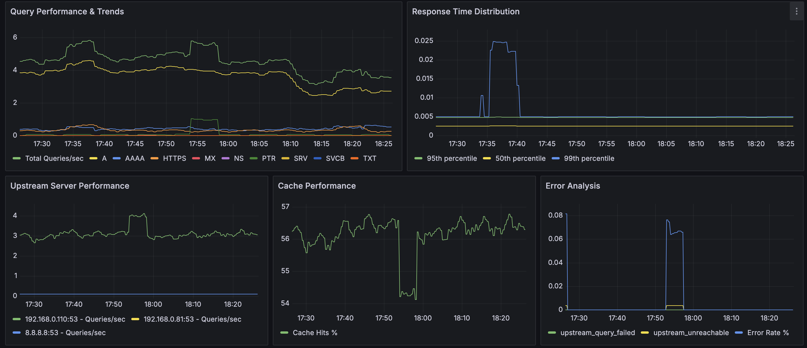

# DNS Forwarder

A high-performance, cache-enabled DNS forwarder written in Go. This project forwards DNS queries to upstream servers, caches responses for improved performance, and provides detailed logging, statistics, and flexible routing features.

*Key Performance Metrics dashboard showing queries/sec, cache hit rate, success rate, upstream health, memory usage, and uptime*

*System resource utilization tracking memory, active goroutines, and cache size over time*

*Detailed performance panels including query trends by type, response time distribution, upstream server performance, cache performance, and error analysis*

## Table of Contents
- [What's New](docs/whats-new.md)
- [Features](docs/features.md)
- [Usage](docs/usage.md)
- [Configuration](docs/configuration.md)
- [Client-Based DNS Routing](docs/client-routing.md)
- [Domain Routing](docs/domain-routing.md)
- [Stale Cache Updater](docs/stale-cache-updater.md)
- [Monitoring and Metrics](docs/monitoring.md)
- [License](#license)
- [Credits](docs/credits.md)
