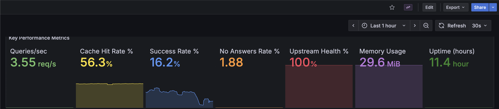

# Monitoring and Metrics

## Logging & Stats
- Logs are written to stdout and kept in a ring buffer for diagnostics.
- Periodic logs show DNS usage and cache hit/miss rates.
- When client routing is enabled, logs show which servers are being used for each client.
- Client routing decisions and server health status are logged for troubleshooting.

## Prometheus Metrics
When `ENABLE_METRICS=true`, the following metrics are available at `/metrics` endpoint:

### DNS Query Metrics
- `dns_queries_total` - Total DNS queries processed (by type and status)
- `dns_query_duration_seconds` - DNS query duration histogram

### Cache Metrics
- `dns_cache_hits_total` - Total cache hits
- `dns_cache_misses_total` - Total cache misses
- `dns_cache_size` - Current cache size

### Upstream Server Metrics
- `dns_upstream_queries_total` - Queries sent to upstream servers
- `dns_upstream_query_duration_seconds` - Upstream query duration
- `dns_upstream_servers_reachable` - Server reachability status
- `dns_upstream_servers_total` - Total configured servers

### System Metrics
- `dns_server_uptime_seconds_total` - Server uptime
- `dns_server_memory_usage_bytes` - Memory usage
- `dns_server_goroutines` - Active goroutines

### Error Metrics
- `dns_errors_total` - Total DNS errors (by error type and source)

### Device IP and Domain Metrics
- `dns_device_ip_queries_total` - Total DNS queries per device IP
- `dns_domain_queries_total` - Total DNS queries per domain (by domain and status)
- `dns_domain_hits_total` - Total hits per domain

## Health Check Endpoints
- `/health` - Simple health check (returns "OK")
- `/status` - JSON status response

## Example Prometheus Configuration
```yaml
scrape_configs:
  - job_name: 'dns-forwarder'
    static_configs:
      - targets: ['localhost:8080']
    metrics_path: '/metrics'
    scrape_interval: 30s
```

## Observability Stack Deployment

The project includes a complete observability stack with Prometheus and Grafana that can be deployed using Docker Compose. This stack provides real-time monitoring, visualization, and alerting capabilities for your DNS forwarder.


### What's Included

The observability stack in the `observe/` directory includes:
- **Prometheus**: Metrics collection and time-series database
- **Grafana**: Visualization and dashboarding with pre-configured DNS dashboard
- **Pre-configured Dashboard**: Ready-to-use Grafana dashboard with all DNS forwarder metrics

### Quick Start

1. **Configure Prometheus Target**

   Edit `observe/prometheus/prometheus.yml` and update the DNS forwarder service IP:
   ```yaml
   scrape_configs:
     - job_name: 'dns-forwarder'
       static_configs:
         - targets: ['192.168.1.100:8080']  # Change to your DNS forwarder IP
       metrics_path: '/metrics'
       scrape_interval: 30s
   ```

2. **Enable Metrics on DNS Forwarder**

   Ensure your DNS forwarder is running with metrics enabled:
   ```bash
   ENABLE_METRICS=true ./dnsforwarder
   ```

3. **Deploy the Observability Stack**

   From the `observe/` directory:
   ```bash
   cd observe
   docker-compose up -d
   ```

4. **Access the Services**
   - Grafana: http://localhost:3000 (default credentials: admin/VERYSECUREPASSWORD)
   - Prometheus: http://localhost:9090

### Dashboard Features


*Key Performance Metrics dashboard showing queries/sec, cache hit rate, success rate, upstream health, memory usage, and uptime*


*System resource utilization tracking memory, active goroutines, and cache size over time*


*Detailed performance panels including query trends by type, response time distribution, upstream server performance, cache performance, and error analysis*

The included Grafana dashboard provides:
- **Key Performance Metrics**: Queries/sec, cache hit rate, success rate, upstream health
- **System Resource Utilization**: Memory usage, goroutines, cache size over time
- **Query Performance & Trends**: Query rates by record type with detailed breakdowns
- **Response Time Distribution**: Percentile-based latency analysis (50th, 95th, 99th)
- **Upstream Server Performance**: Per-server query rates and health status
- **Cache Performance**: Real-time cache hit percentage trends
- **Error Analysis**: Error rates and types for troubleshooting
- **Device and Domain Analytics**: Query patterns by client IP and domain

### Customization

**Change Grafana Admin Password**

Edit `observe/docker-compose.yml`:
```yaml
environment:
  - GF_SECURITY_ADMIN_PASSWORD=your-secure-password
```

**Adjust Scrape Intervals**

Edit `observe/prometheus/prometheus.yml` to change how frequently metrics are collected:
```yaml
global:
  scrape_interval: 10s  # Adjust as needed
```

**Data Persistence**

Metrics and dashboard data are persisted in Docker volumes:
- `prometheus_data`: Time-series metrics storage
- `grafana_data`: Dashboard configurations and user settings
